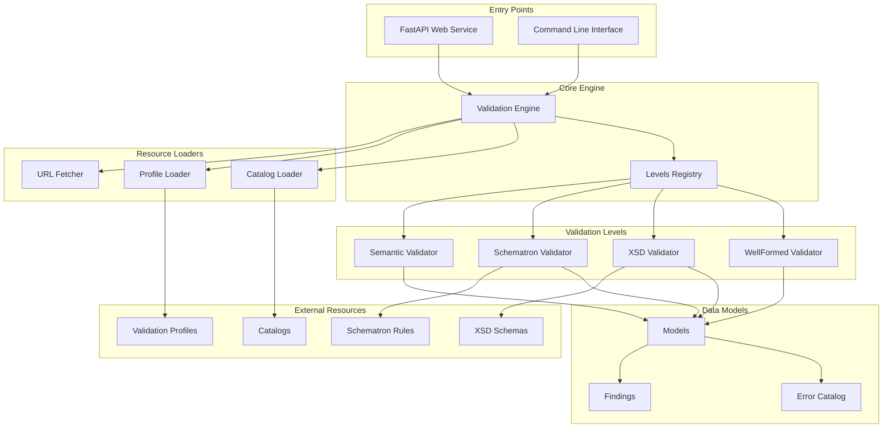

# Architecture Overview

The MITS Validator follows a modular, layered architecture designed for extensibility, reliability, and maintainability.

## System Architecture

## Module Responsibilities

### Entry Points

**FastAPI Web Service** (`src/mits_validator/api.py`)
- Provides RESTful API endpoints for validation
- Handles file uploads and URL validation
- Implements defensive input validation
- Returns structured JSON responses

**Command Line Interface** (`src/mits_validator/cli.py`)
- Provides command-line interface for validation
- Supports file and URL input
- Offers JSON output format
- Implements proper exit codes

### Core Engine

**Validation Engine** (`src/mits_validator/validation.py`)
- Orchestrates the validation process
- Manages validation levels execution
- Handles profile-based configuration
- Aggregates results from all levels

**Levels Registry** (part of Validation Engine)
- Manages validation level lifecycle
- Ensures proper execution order
- Handles level isolation and error recovery
- Tracks execution status and timing

### Validation Levels

**WellFormed Validator** (`src/mits_validator/validation.py`)
- Validates XML syntax and structure
- Always executed as foundation level
- Emits `WELLFORMED:*` error codes
- Handles XML parsing errors gracefully

**XSD Validator** (`src/mits_validator/levels/xsd.py`)
- Validates XML against XSD schemas
- Executed when schemas are available
- Emits `XSD:*` error codes
- Supports schema loading and validation

**Schematron Validator** (`src/mits_validator/levels/schematron.py`)
- Validates business rules and constraints
- Executed when rules are available
- Emits `SCHEMATRON:*` error codes
- Supports rule loading and execution

**Semantic Validator** (`src/mits_validator/levels/semantic.py`)
- Validates semantic consistency
- Uses catalog data for validation
- Emits `SEMANTIC:*` error codes
- Supports cross-field validation

### Resource Loaders

**Catalog Loader** (`src/mits_validator/catalog_loader.py`)
- Loads and validates MITS catalogs
- Supports versioned catalog structure
- Handles JSON schema validation
- Provides soft-fail behavior

**Profile Loader** (`src/mits_validator/profile_loader.py`)
- Loads validation profiles
- Supports level toggles and severity overrides
- Handles profile configuration
- Provides default fallbacks

**URL Fetcher** (`src/mits_validator/url_fetcher.py`)
- Fetches content from URLs
- Implements streaming with size limits
- Handles network errors gracefully
- Supports timeout configuration

### Data Models

**Models** (`src/mits_validator/models.py`)
- Defines core data structures
- Provides type safety
- Supports serialization
- Ensures consistency

**Error Catalog** (`src/mits_validator/errors.py`)
- Centralized error code definitions
- Standardized error messages
- Severity level management
- Remediation guidance

**Findings** (`src/mits_validator/findings.py`)
- Represents validation findings
- Supports location information
- Handles severity levels
- Provides rule references

## Design Principles

### 1. Modularity
Each component has a single responsibility and can be developed, tested, and maintained independently.

### 2. Extensibility
New validation levels can be added without modifying existing code. The registry pattern enables dynamic level registration.

### 3. Isolation
Validation level failures are isolated and don't crash the entire validation process. Each level can fail independently.

### 4. Defensive Programming
All inputs are validated, all operations have timeouts, and all errors are handled gracefully.

### 5. Type Safety
Comprehensive type hints ensure compile-time error detection and improve code maintainability.

### 6. Testability
All components are designed for easy testing with clear interfaces and dependency injection.

## Data Flow

1. **Input Validation**: API/CLI validates input format and constraints
2. **Profile Loading**: Validation profile determines which levels to run
3. **Level Execution**: Each enabled level validates the content
4. **Result Aggregation**: Results from all levels are combined
5. **Response Generation**: Structured response is generated and returned

## Error Handling Strategy

### Error Categories
- **INTAKE**: Input validation errors
- **WELLFORMED**: XML parsing errors
- **XSD**: Schema validation errors
- **SCHEMATRON**: Business rule errors
- **SEMANTIC**: Semantic validation errors
- **NETWORK**: Network operation errors
- **ENGINE**: Engine-level errors

### Error Isolation
- Each validation level can fail independently
- Level failures are captured as findings
- Engine continues execution after level failures
- No single failure can crash the entire process

## Configuration Management

### Environment Variables
- `MITS_MAX_FILE_SIZE`: Maximum file size limit
- `MITS_TIMEOUT_SECONDS`: Request timeout
- `MITS_ALLOWED_CONTENT_TYPES`: Allowed content types
- `URL_FETCH_TIMEOUT_SECONDS`: URL fetch timeout
- `URL_FETCH_MAX_BYTES`: URL content size limit

### Profile Configuration
- Level enablement toggles
- Severity level overrides
- Intake limit customization
- Content type restrictions

## Security Considerations

### Input Validation
- File size limits prevent DoS attacks
- Content type validation prevents malicious uploads
- URL validation restricts to safe schemes
- Timeout limits prevent resource exhaustion

### Data Handling
- No persistent storage of uploaded content
- Memory-only processing
- No sensitive data in logs
- Secure error messages

### Network Security
- HTTPS-only URL fetching
- Request timeout limits
- Size limits for remote content
- No external dependencies

## Performance Characteristics

### Scalability
- Stateless design enables horizontal scaling
- Memory-efficient streaming for large files
- Configurable resource limits
- Optimized for concurrent requests

### Resource Usage
- Minimal memory footprint
- Efficient XML parsing
- Streaming URL fetching
- Configurable timeouts

## Future Extensibility

### New Validation Levels
1. Create new validator class
2. Implement validation interface
3. Register with levels registry
4. Add error codes to catalog
5. Update documentation

### New Resource Types
1. Create resource loader
2. Implement loading interface
3. Add to validation engine
4. Update configuration
5. Add tests and documentation

### New MITS Versions
1. Create versioned resource directory
2. Add version-specific schemas and rules
3. Update catalog loader
4. Add version validation
5. Update documentation

## Monitoring and Observability

### Structured Logging
- Request ID tracking
- Duration measurement
- Error counting
- Performance metrics

### Health Checks
- Service availability
- Resource status
- Dependency health
- Performance indicators

### Metrics Collection
- Request count and duration
- Error rates by type
- Validation level performance
- Resource usage

This architecture provides a solid foundation for MITS validation while maintaining flexibility for future enhancements and MITS specification changes.
